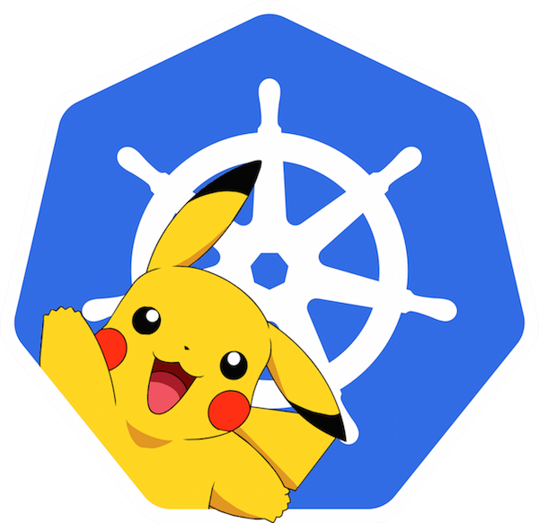
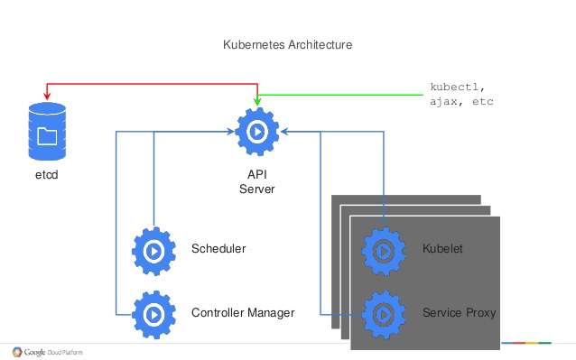
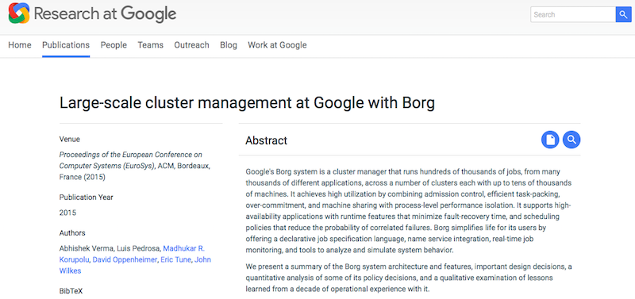
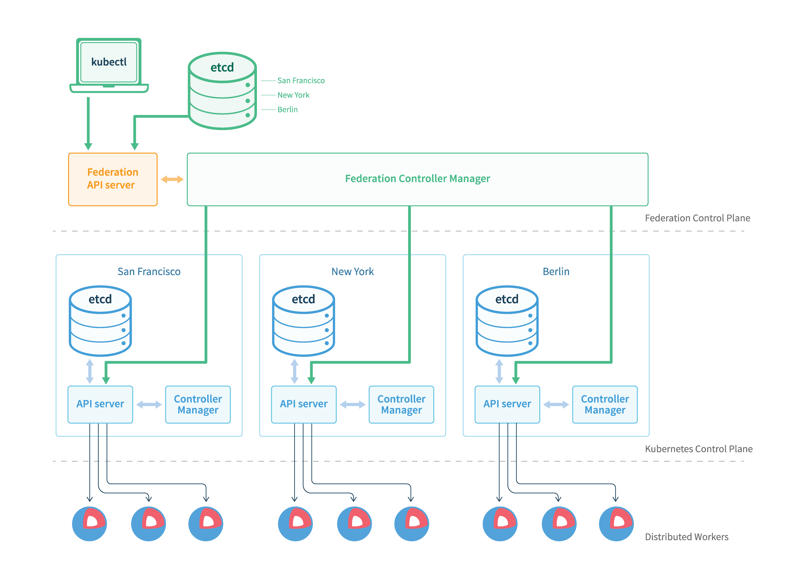
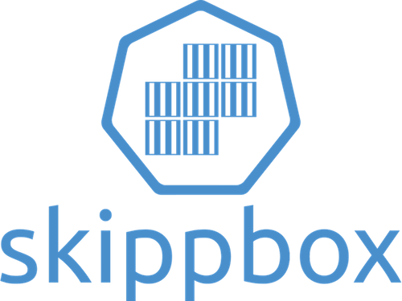

# Why I Love Kubernetes ?
# Top 10 Reasons

## Sebastien Goasguen, @sebgoa
### https://github.com/skippbox
### https://github.com/sebgoa

---
# Who am I ?

**Founder** [Skippbox](http://skippbox.com), a Kubernetes startup providing solutions, services and training.

* Docker cookbook author
* Helm maintainer
* ASF member
* Former Apache CloudStack VP

**Products:**

* kmachine
* kompose
* CloudStack Container Service (CaaS solution)
* Cabin

Plus other open source tools.

---

# News of the Day
<center>

</center>

## Last week [really](https://cloudplatform.googleblog.com/2016/09/bringing-Pokemon-GO-to-life-on-Google-Cloud.html)
---
# Outline

## Quick Introduction to Kubernetes
## #1 ...
## #2 ...

---

## Introduction

[Kubernetes](http://kubernetes.io) is an open-source software for automating deployment, scaling, and management of containerized applications.

Builds on 15 years of experience at Google.

* Open Source and available on GitHub
* Apache Software License
* Now governed by the Cloud Native Computing Foundation at the Linux Foundation
* Several Special Interest Groups (SIG)
* Open to everyone
* Weekly Hangouts

---

## Why a container Orchestrator ?

But managing containers at scale and architecting a distributed applications based on microservices principles is still challenging.

According to recent [CF report](https://www.cloudfoundry.org/wp-content/uploads/2016/06/Cloud-Foundry-2016-Container-Report.pdf):

* **45% users see containers as too complex to integrate in current environment**

Biggest concern:

* **50% container management**
* **25% Multi-container apps.**

---

## What is Kubernetes really ?

* Greek for "Helmsman"
* A cluster manager
* A scheduler to place containers in a cluster
* Lots of HA features
* Geared towards managing apps at scale
* Deployed as services on VMs or Bare-metal machines



---

## How is it doing ?

* Open Source in June 2014 (2 years old)
* 1000 + contributors
* 200k commits
* Second Biggest Golang project on GitHub (Docker #1)
* Google and Red Hat lead contributors
* Meetups in +100 cities worldwide
* 6000 people on Slack
* 1 release every ~3 months

---
# #1 Borg Heritage

* Borg was a Google secret for a long time.
* Orchestration system to manage all Google applications at scale
* Finally described publicly in 2015
* [Paper](http://research.google.com/pubs/pub43438.html) explains ideas behind Kubernetes



---
# #1 Borg Heritage/Lineage

* Google contributed `cgroups` to the Linux kernel
* `cgroups` and linux `namespaces` at the heart of containers
* Mesos was inspired by discussions with Google when Borg was still secret
* Cloud Foundry implements 12 factor apps principles for microservices apps.


---
# #2 Easy to Deploy

Pick your medicine, Chef, Puppet, Ansible...or GKE

Ansible playbooks with CoreOS or Atomic ...

```
$ ansible-playbooks k8s.yml
```

New `kubeadm` command now an Alpha feature

```
$ kubeadm init
$ kubeadm join
```

---
# #3 API is clean and "learnable"

* HTTP REST API
* Resources well defined
* Groups of API resources
* Versioned in each release

```
apiVersion
kind
metadata
spec
```

---
# #4 Great CLI `kubectl`

`kubectl` is the CLI for Kubernetes

```
$ kubectl get pods,svc,deployments
$ kubectl create -f ./<DIR>
$ kubectl create -f <URL>
$ kubectl edit ...
$ kubectl label
$ kubectl proxy ...
$ kubectl exec ...
$ kubectl logs ...
$ kubectl --v=99 ...
$ kubect config view
$ kubectl config use-context
```

---
# #5 Development solution `minikube`

To help develop or learn Kubernetes you can use minikube.

** A VM that contains a single-node standalone k8s **

```
$ minikube start
Starting local Kubernetes cluster...
Kubectl is now configured to use the cluster.

$ kubectl get nodes
NAME       STATUS    AGE
minikube   Ready     25s
```

---
# #6 Rolling-updates and Rollback

Rollout and Rollbacks are enabled by a first class primitive (i.e Deployments).

You can keep simple annotation of changes made.

Rollback to a specific revision, or undo latest change.

Edits on the resource trigger a new rollout.

```
$ kubectl run ghost --image=ghost
```

Now do an update and check the status. You can now roll back.

```
$ kubectl rollout history deployment/ghost
deployments "ghost":
REVISION	CHANGE-CAUSE
1		kubectl run ghost --image=ghost --record
2		kubectl set image deployment/ghost ghost=ghost:09 --all

$ kubectl rollout undo deployment/ghost
```

---
# #7 Quotas

## Out of the Box

A resource quota, defined by a ResourceQuota object, provides constraints that limit aggregate resource consumption per namespace. It can limit the quantity of objects that can be created, as well as the total amount of compute resources that may be consumed by resources in that project.

Then create a _ResourceQuota_ to limit the number of Pods

<pre>
$ cat rq.yaml
apiVersion: v1
kind: ResourceQuota
metadata:
  name: object-counts
spec:
  hard:
    pods: "1"
...
$ kubectl create -f rq.yaml --namespace=linuxcon
</pre>

---
# #8 Third Party Resources

Create your own API objects and let Kubernetes manage it.

<pre>
metadata:
  name: pin-guin.k8s.linuxcon.com
apiVersion: extensions/v1beta1
kind: ThirdPartyResource
description: "A crazy pinguin at Linuxcon"
versions:
- name: v1
</pre>

You get an HTTP REST API for `pinguins`

<pre>
apiVersion: k8s.linuxcon.com/v1
kind: PinGuin
metadata:
  name: crazy
  labels:
    linuxcon: rocks
</pre>

---
# #9 Role Based Access Controls (RBAC)

## Now an alpha feature

Thanks to the great folks at CoreOS, now alpha.

Define Roles and Role bindings.

<pre>
kind: Role
apiVersion: rbac.authorization.k8s.io/v1alpha1
metadata:
  namespace: default
  name: pod-reader
rules:
  - apiGroups: [""] # The API group "" indicates the default API Group.
    resources: ["pods"]
    verbs: ["get", "watch", "list"]
    nonResourceURLs: []
</pre>

Read Pods information. Bind this role to a user.

---
# #10 Cluster Federation

Now available in 1.4.0
<center>

</center>
---

# Thanks, Questions ?
<center>
	
</center>
## @sebgoa / @skippbox